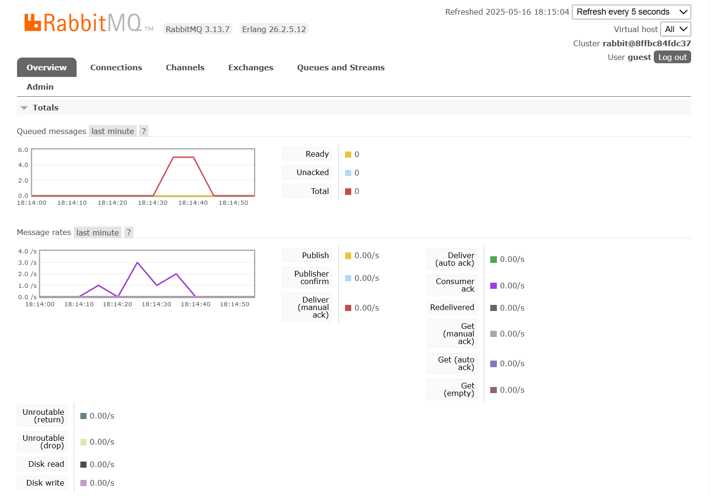

a. What is amqp? 

AMQP (Advanced Message Queuing Protocol) is a messaging protocol that enables applications to communicate with each other by sending messages through a message broker 

b. What does it mean? guest:guest@localhost:5672 , what is the first guest, and what is the second guest, and what is localhost:5672 is for?

The first guest refers to the username, and the second guest refers to the password, localhost tells the program to connect to a message broker running locally on the computer, and 5672 is the default port used by the broker for AMQP connections.

- Simulation slow subscriber

  The total number of queued messages on my machine increased to 17 when I ran the publisher, which sent multiple messages to the queue at once. Since the consumer didn’t process them immediately, the messages built up in the queue. After a few seconds, the consumer processed all 17 messages, and the queue total dropped back to zero.

- Running at least three subscribers

  On my machine, the total number of queued messages went up to 5 when the publisher sent several messages in a short burst. The spike happened because the consumer didn’t process the messages right away, so they temporarily stayed in the queue. After a few seconds, the consumer caught up and processed all of them, bringing the total back to zero. This shows that the message flow is working correctly, messages are being sent, queued, and eventually consumed.