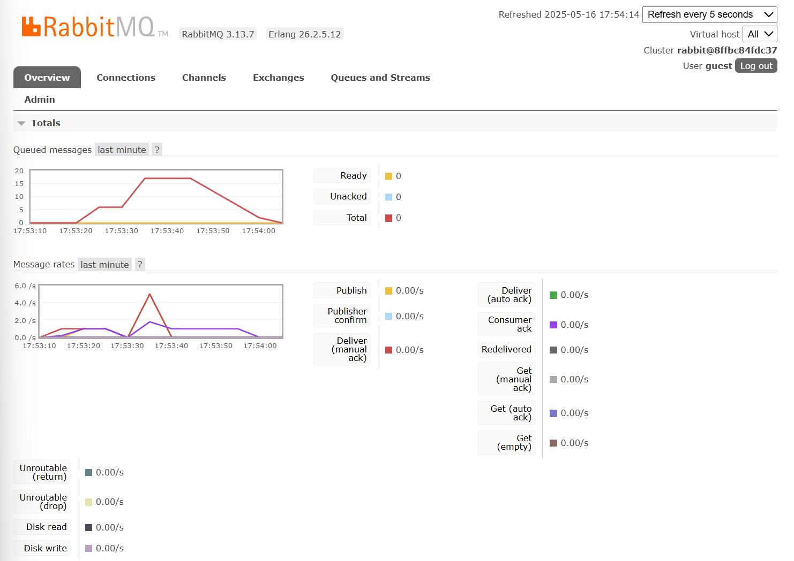

a. What is amqp? 

AMQP (Advanced Message Queuing Protocol) is a messaging protocol that enables applications to communicate with each other by sending messages through a message broker 

b. What does it mean? guest:guest@localhost:5672 , what is the first guest, and what is the second guest, and what is localhost:5672 is for?

The first guest refers to the username, and the second guest refers to the password, localhost tells the program to connect to a message broker running locally on the computer, and 5672 is the default port used by the broker for AMQP connections.

- Simulation slow subscriber

  The total number of queued messages on my machine increased to 17 when I ran the publisher, which sent multiple messages to the queue at once. Since the consumer didn’t process them immediately, the messages built up in the queue. After a few seconds, the consumer processed all 17 messages, and the queue total dropped back to zero.